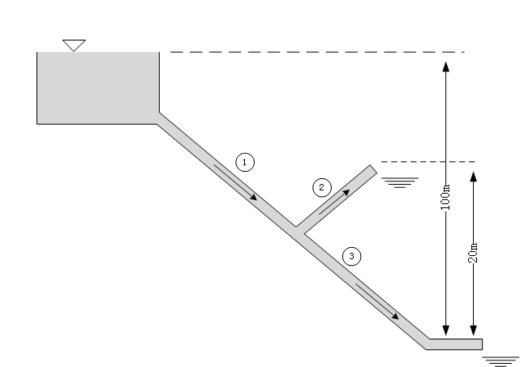
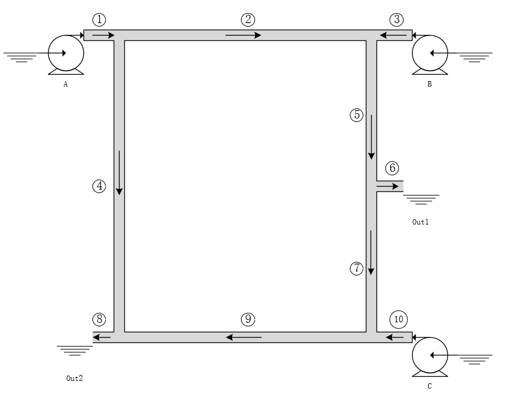
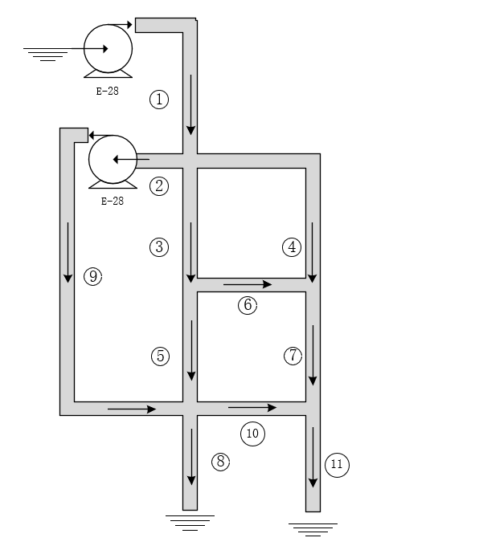

# IncompressiblePipe System

This page shows 5 examples of `IncompressiblePipe System`. By default, fluid passing pipes is water.

Examples finsh 3 steps:

1. Define components from `IncompressiblePipe`
2. Connect components
3. Solve

## Example 1

The height of Pipe1's inlet port is 25m. Actually, this is a **trick** that makes potential energy of `source` added to  Pipe1's inlet port. Because the height is a parameter in system instead of a variable so that it can't be *passed on* between components.


```@example 1
using Ai4EComponentLib.IncompressiblePipe
using DifferentialEquations, ModelingToolkit, Test

@named high = Source_P(D=0.15, z=25.0)
@named low = Sink_P()
@named elbow1 = ElbowPipe(K=0.9, D=0.15)
@named elbow2 = ElbowPipe(K=0.9, D=0.15, zin=15.0, zout=15.0)
@named pipe1 = SimplePipe(L=30.0, D=0.15, f=0.023, zin=25.0, zout=0.0)
@named pipe2 = SimplePipe(L=15.0, D=0.15, f=0.023, zin=0.0, zout=15.0)
@named pipe3 = SimplePipe(L=60.0, D=0.15, f=0.023, K_inside=10.8, zin=15.0, zout=15.0)

eqs = [
    connect(high.port, pipe1.in)
    connect(pipe1.out, elbow1.in)
    connect(elbow1.out, pipe2.in)
    connect(pipe2.out, elbow2.in)
    connect(elbow2.out, pipe3.in)
    connect(pipe3.out, low.port)
]

@named model = compose(ODESystem(eqs, t, name=:funs), [high, low, pipe1, pipe2, pipe3, elbow1, elbow2])

sys = structural_simplify(model)

prob = ODEProblem(sys, [], (0.0, 0.0))

sol = solve(prob)

sol[pipe1.in.q]
```

## Example 2



```@example 2
using Ai4EComponentLib.IncompressiblePipe
using DifferentialEquations, ModelingToolkit, Test

@named high = Source_P(D=1.0, z=100.0, K_inlet=0.0)
@named low1 = Sink_P()
@named low2 = Sink_P()
@named pipe1 = SimplePipe(L=1000.0, D=1.0, f=0.02, zin=100.0, zout=10.0)
@named pipe2 = SimplePipe(L=500.0, D=1.0, f=0.02, zin=10.0, zout=20.0)
@named pipe3 = SimplePipe(L=400.0, D=1.0, f=0.02, zin=10.0, zout=0.0)

eqs = [
    connect(high.port, pipe1.in)
    connect(pipe1.out, pipe3.in, pipe2.in)
    connect(pipe2.out, low1.port)
    connect(pipe3.out, low2.port)
]
 
@named model = compose(ODESystem(eqs, t, name=:funs), [high, low1, low2, pipe1, pipe2, pipe3])

sys = structural_simplify(model)

prob = ODEProblem(sys, [], (0.0, 0.0))

sol = solve(prob)

res = Dict()
for i in [pipe1,pipe2,pipe3]
  global res[string(i.name) * " inlet flow:"] = sol[i.in.q][1]
end
res
```

In this example, the height of Pipe1's outlet port will not change the result.
Let's try `15m`.

```@example 2
@named high = Source_P(D=1.0, z=100.0, K_inlet=0.0)
@named low1 = Sink_P()
@named low2 = Sink_P()
@named pipe1 = SimplePipe(L=1000.0, D=1.0, f=0.02, zin=100.0, zout=15.0)
@named pipe2 = SimplePipe(L=500.0, D=1.0, f=0.02, zin=15.0, zout=20.0)
@named pipe3 = SimplePipe(L=400.0, D=1.0, f=0.02, zin=15.0, zout=0.0)

eqs = [
    connect(high.port, pipe1.in)
    connect(pipe1.out, pipe3.in, pipe2.in)
    connect(pipe2.out, low1.port)
    connect(pipe3.out, low2.port)
]
 
@named model = compose(ODESystem(eqs, t, name=:funs), [high, low1, low2, pipe1, pipe2, pipe3])

sys = structural_simplify(model)

prob = ODEProblem(sys, [], (0.0, 0.0))

sol = solve(prob)

res = Dict()
for i in [pipe1,pipe2,pipe3]
  global res[string(i.name) * " inlet flow:"] = sol[i.in.q][1]
end
res
```

## Example 3

Components in `Example 3` ~ `Example 5` are puted on the same horizontal level.



```@example 3
using Ai4EComponentLib.IncompressiblePipe
using DifferentialEquations, ModelingToolkit, Test

system = []

@named pumpA = CentrifugalPump();
push!(system, pumpA);
@named pumpB = CentrifugalPump();
push!(system, pumpB);
@named pumpC = CentrifugalPump();
push!(system, pumpC);

@named pipe1 = SimplePipe(L=1.0);
push!(system, pipe1);
@named pipe2 = SimplePipe(L=10.0);
push!(system, pipe2);
@named pipe3 = SimplePipe(L=1.0);
push!(system, pipe3);
@named pipe4 = SimplePipe(L=10.0);
push!(system, pipe4);
@named pipe5 = SimplePipe(L=5.0);
push!(system, pipe5);
@named pipe6 = SimplePipe(L=1.0);
push!(system, pipe6);
@named pipe7 = SimplePipe(L=5.0);
push!(system, pipe7);
@named pipe8 = SimplePipe(L=1.0);
push!(system, pipe8);
@named pipe9 = SimplePipe(L=10.0);
push!(system, pipe9);
@named pipe10 = SimplePipe(L=1.0);
push!(system, pipe10);

@named sink1 = Sink_P(p=1.0E5);
push!(system, sink1);
@named sink2 = Sink_P(p=1.0E5);
push!(system, sink2);
@named sink3 = Sink_P(p=1.0E5);
push!(system, sink3);
@named sink4 = Sink_P(p=1.0E5);
push!(system, sink4);
@named sink5 = Sink_P(p=1.0E5);
push!(system, sink5);


eqs = [
  connect(sink3.port, pumpA.in)
  connect(pumpA.out, pipe1.in)
  connect(pipe1.out, pipe2.in, pipe4.in)
  connect(pipe2.out, pipe3.out, pipe5.in)
  connect(sink4.port, pumpB.in)
  connect(pumpB.out, pipe3.in)
  connect(pipe5.out, pipe6.in, pipe7.in)
  connect(pipe6.out, sink1.port)
  connect(pipe4.out, pipe9.out, pipe8.in)
  connect(pipe7.out, pipe10.out, pipe9.in)
  connect(sink5.port, pumpC.in)
  connect(pipe10.in, pumpC.out)
  connect(pipe8.out, sink2.port)
]

@named model = compose(ODESystem(eqs, t, name=:funs), system)
sys = structural_simplify(model)
prob = ODEProblem(sys, [], (0, 0.0))
sol = solve(prob)

res = Dict()
for i in system[4:end-5]
  global res[string(i.name) * " inlet flow:"] = sol[i.in.q][1]
end
res
```

## Example 4

In this example, value of inlet flow is a negative number which means the flow direction and arrow are in opposite direction.



```@example 4
using Ai4EComponentLib.IncompressiblePipe
using DifferentialEquations, ModelingToolkit, Test

system = []
@named pumpA = CentrifugalPump();
push!(system, pumpA);
@named pumpB = CentrifugalPump();
push!(system, pumpB);

@named pipe1 = SimplePipe(L=1.0);
push!(system, pipe1);
@named pipe2 = SimplePipe(L=2.0);
push!(system, pipe2);
@named pipe3 = SimplePipe(L=2.0);
push!(system, pipe3);
@named pipe4 = SimplePipe(L=4.0);
push!(system, pipe4);
@named pipe5 = SimplePipe(L=2.0);
push!(system, pipe5);
@named pipe6 = SimplePipe(L=2.0);
push!(system, pipe6);
@named pipe7 = SimplePipe(L=2.0);
push!(system, pipe7);
@named pipe8 = SimplePipe(L=1.0);
push!(system, pipe8);
@named pipe9 = SimplePipe(L=6.0);
push!(system, pipe9);
@named pipe10 = SimplePipe(L=2.0);
push!(system, pipe10);
@named pipe11 = SimplePipe(L=1.0);
push!(system, pipe11);

@named sink0 = Sink_P();
push!(system, sink0);
@named sink1 = Sink_P();
push!(system, sink1);
@named sink2 = Sink_P();
push!(system, sink2);

eqs = [
  connect(sink0.port, pumpA.in)
  connect(pumpA.out, pipe1.in)
  connect(pipe1.out, pipe2.in, pipe3.in, pipe4.in)
  connect(pipe2.out, pumpB.in)
  connect(pumpB.out, pipe9.in)
  connect(pipe3.out, pipe5.in, pipe6.in)
  connect(pipe6.out, pipe4.out, pipe7.in)
  connect(pipe7.out, pipe10.out, pipe11.in)
  connect(pipe11.out, sink2.port)
  connect(pipe9.out, pipe5.out, pipe10.in, pipe8.in)
  connect(pipe8.out, sink1.port)
]

@named model = compose(ODESystem(eqs, t, name=:funs), system)
sys = structural_simplify(model)
prob = ODEProblem(sys, [], (0, 0.0))
sol = solve(prob)

res = Dict()
for i in system[3:end-3]
  global res[string(i.name) * " inlet flow:"] = sol[i.in.q][1]
end
res
```

## Example 5

  

```@example 5
using Ai4EComponentLib.IncompressiblePipe
using DifferentialEquations, ModelingToolkit, Test

@named Pump = CentrifugalPump(ω=5000)
@named A = Sink_P()
@named B = Sink_P()

system = [A, B, Pump]

@named Pipe1 = SimplePipe(L=2.0);
push!(system, Pipe1);
@named Pipe2 = SimplePipe(L=3.0);
push!(system, Pipe2);
@named Pipe3 = SimplePipe(L=7.0);
push!(system, Pipe3);
@named Pipe4 = SimplePipe(L=9.0);
push!(system, Pipe4);
@named Pipe5 = SimplePipe(L=5.0);
push!(system, Pipe5);
@named Pipe6 = SimplePipe(L=4.0);
push!(system, Pipe6);
@named Pipe7 = SimplePipe(L=5.0);
push!(system, Pipe7);
@named Pipe8 = SimplePipe(L=1.0);
push!(system, Pipe8);
@named Pipe9 = SimplePipe(L=10.0);
push!(system, Pipe9);
@named Pipe10 = SimplePipe(L=2.0);
push!(system, Pipe10);
@named Pipe11 = SimplePipe(L=2.0);
push!(system, Pipe11);
@named Pipe12 = SimplePipe(L=3.0);
push!(system, Pipe12);
@named Pipe13 = SimplePipe(L=12.0);
push!(system, Pipe13);
@named Pipe14 = SimplePipe(L=1.0);
push!(system, Pipe14);
@named Pipe15 = SimplePipe(L=2.0);
push!(system, Pipe15);
@named Pipe16 = SimplePipe(L=3.0);
push!(system, Pipe16);
@named Pipe17 = SimplePipe(L=6.0);
push!(system, Pipe17);
@named Pipe18 = SimplePipe(L=6.0);
push!(system, Pipe18);
@named Pipe19 = SimplePipe(L=6.0);
push!(system, Pipe19);
@named Pipe20 = SimplePipe(L=1.0);
push!(system, Pipe20);
@named Pipe21 = SimplePipe(L=1.0);
push!(system, Pipe21);
@named Pipe22 = SimplePipe(L=7.0);
push!(system, Pipe22);
@named Pipe23 = SimplePipe(L=3.0);
push!(system, Pipe23);
@named Pipe24 = SimplePipe(L=3.0);
push!(system, Pipe24);
@named Pipe25 = SimplePipe(L=2.0);
push!(system, Pipe25);

eqs = [
  connect(A.port, Pump.in)
  connect(Pump.out, Pipe1.in)
  connect(Pipe1.out, Pipe2.in, Pipe5.in)
  connect(Pipe2.out, Pipe3.in, Pipe6.in)
  connect(Pipe3.out, Pipe4.in, Pipe7.in)
  connect(Pipe4.out, Pipe10.out, Pipe14.in)
  connect(Pipe5.out, Pipe11.in, Pipe12.in)
  connect(Pipe6.out, Pipe8.in, Pipe9.in)
  connect(Pipe7.out, Pipe9.out, Pipe10.in)
  connect(Pipe12.out, Pipe8.out, Pipe13.in)
  connect(Pipe13.out, Pipe14.out, Pipe15.in)
  connect(Pipe11.out, Pipe19.in, Pipe16.in)
  connect(Pipe16.out, Pipe17.in, Pipe20.in)
  connect(Pipe17.out, Pipe18.in, Pipe21.in)
  connect(Pipe18.out, Pipe15.out, Pipe22.in)  
  connect(Pipe19.out, Pipe20.out, Pipe23.in)  
  connect(Pipe21.out, Pipe22.out, Pipe24.in)  
  connect(Pipe23.out, Pipe24.out, Pipe25.in)  
  connect(B.port, Pipe25.out)
]


@named model = compose(ODESystem(eqs, t, name=:funs), system)
sys = structural_simplify(model)
prob = ODEProblem(sys, [], (0, 0.0))
sol = solve(prob)

res = Dict()
for i in system[4:end]
  global res[string(i.name) * " inlet flow:"] = sol[i.in.q][1]
end
res
```
